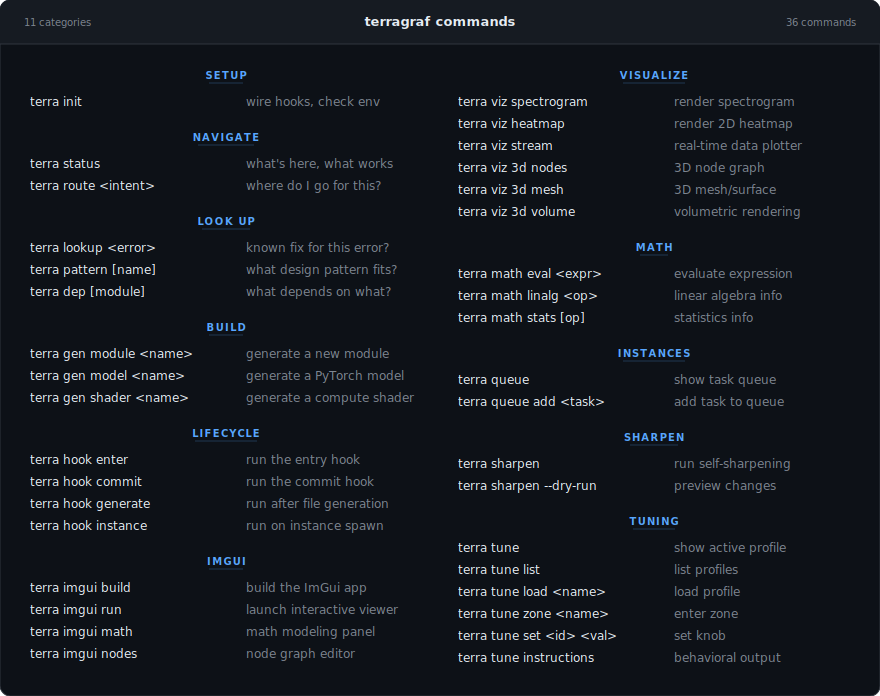

# Terragraf

**This is not a code generator. This is the environment the AI operates inside of.**

[](https://github.com/curbthepain/Terragraf/actions/workflows/ci.yml)

Terragraf is the working directory any AI reads on entry. It provides
structure, navigation, composition, and execution — everything an AI
needs to orient itself in a codebase and start producing immediately.

Tools like Claude Code, Cursor, and Aider burn context window on
rediscovering project structure every session. Terragraf eliminates
that tax — the AI reads headers, follows routes, and consults tables
instead of scanning every file or relying on summarization.

---

## Quickstart

```bash
# Clone and enter
git clone https://github.com/curbthepain/Terragraf.git
cd Terragraf

# Install dependencies
pip install -r requirements.txt          # core (numpy, scipy)
pip install -r requirements-dev.txt      # + pytest
pip install -r requirements-ml.txt       # + torch
pip install -r requirements-app.txt      # + PySide6 (Qt GUI)

# Initialize in your project
./terra init

# See what's here
./terra status

# Route an intent
./terra route bug        # -> routes/bugs.route
./terra route feature    # -> headers/project.h

# Launch the Qt container app
./terra app

# Build and run the ImGui viewer
./terra imgui build
./terra imgui run
```

---

## Quick Reference



See [COMMANDS.md](COMMANDS.md) for the full command reference with
descriptions.

---

## Architecture

```
.scaffold/
├── headers/          .h    — what exists (modules, deps, platform targets)
├── includes/         .inc  — composable fragments (license, test skeletons)
├── routes/           .route — intent -> location ("fix bug" -> bugs.route)
├── tables/           .table — pre-made decisions (error fixes, dep graphs)
├── generators/             — scripts that read structure and produce output
├── instances/              — peer AI instances sharing one scaffold (socket + filesystem IPC)
├── git/                    — branch/commit/PR workflows baked in
├── sharpen/                — self-sharpening engine (prunes stale, promotes hot)
├── tuning/                 — thematic tension calibration (profiles, knobs, zones)
├── app/                    — Qt container application (PySide6, 5 pages)
├── compute/
│   ├── fft/                — FFT / spectral analysis (numpy + C++ FFTW)
│   ├── math/               — linalg, algebra, stats, transforms
│   ├── shaders/            — Vulkan/GLSL compute shaders
│   ├── vulkan/             — Vulkan instance, pipeline, memory
│   └── render/             — OpenGL mesh + volume renderers
├── viz/                    — spectrograms, heatmaps, 3D nodes, volumes
├── imgui/                  — ImGui viewer (7 panels, TCP bridge to Python)
├── ml/                     — PyTorch models, datasets, training
├── hooks/                  — lifecycle hooks (enter, commit, generate)
└── tests/                  — pytest suite (210 tests)
```

### Headers

`.h` files declare what exists in a project — modules, conventions,
dependencies, platform targets. The AI reads these to understand the
shape of things without scanning every file.

### Routes

`.route` tables map intent to location. "I need to fix a bug" routes to
one place. "I need to add a feature" routes to another. The AI stops
guessing and starts navigating.

### Self-Sharpening

The scaffold updates itself from usage. Stale entries get pruned, hot
entries get annotated, recurring unmatched errors get added to
`errors.table` automatically, and low-confidence routes get flagged.

```bash
terra sharpen --dry-run    # preview what would change
terra sharpen              # apply sharpening
```

### Tuning

Thematic tension calibration — a domain-agnostic behavioral tuning
system. Universe profiles define three core axes (mortality weight,
power fantasy, shitpost tolerance), per-zone overrides, and custom
knobs. The engine generates behavioral instruction blocks the AI reads
on session entry or zone transition.

```bash
terra tune list            # available profiles
terra tune load mythic_roguelike
terra tune zone combat     # shift thematic axes
terra tune instructions    # full behavioral output
```

### Multi-Instancing

Multiple AI instances running as peers instead of a parent/child agent
hierarchy. They share the same scaffolding, pull tasks from a shared
queue, and write results back via socket or filesystem IPC. No context
window tax. No summarization loss. See [INSTANCES.md](INSTANCES.md).

### Qt Container App

The graphical shell for Terragraf. Five pages: Home (landing + status),
Viewer (launch/manage ImGui + bridge processes), Tuning (profile
selector, zone buttons, knob widgets), Debug (bridge monitor, message
log, ping/RTT), Settings (bridge config, paths, persistence). Dark CI
terminal aesthetic. Sidebar navigation with Ctrl+1-5 shortcuts.

```bash
terra app                  # launch the Qt container
terra app --offscreen      # headless mode (testing)
```

### ImGui Viewer

Real-time C++ visualization app with seven dockable panels: Math
(interactive function plotting), Spectrogram (FFT magnitude heatmap),
Node Editor (visual graph editor), Volume Slicer (orthogonal slice
viewer), Tuning (thematic calibration via bridge), Debug (message log,
FPS/RTT graphs), Settings (panel visibility, theme, render config).
Communicates with Python via TCP bridge using length-prefixed JSON.

```bash
terra imgui build          # cmake + make
terra imgui run            # launch viewer
terra imgui bridge         # start Python bridge server
```

---

## What's next

- **End-to-end debug** — compile and run ImGui + bridge.py + Qt on a
  machine with GLFW/Vulkan to verify the full loop.
- **Language-aware output** — generators adapt conventions and tooling
  per project language without separate configurations.

See [ROADMAP.md](ROADMAP.md) for the full phased plan.

---

## Platforms

Linux (Wayland) and Windows 10/11.

## Contributors

| Name | Role | Contact |
|------|------|---------|
| Austin Wisniewski | Creator, Lead | [@curbthepain](https://github.com/curbthepain) |
| Claude (Anthropic) | AI Contributor | [anthropic.com](https://anthropic.com) |

## License

Apache 2.0
