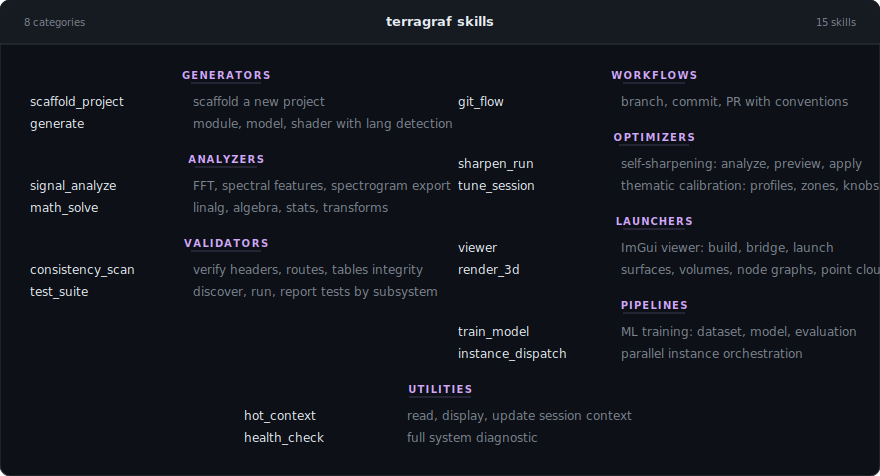
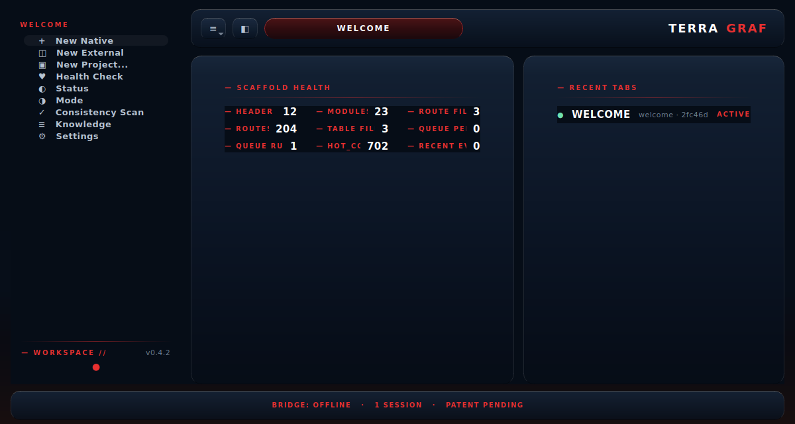

# Terragraf

**This is not a code generator. This is the environment the AI operates inside of.**

[](https://github.com/curbthepain/Terragraf/actions/workflows/ci.yml) 

Terragraf is the working directory any AI reads on entry. It provides
structure, navigation, composition, and execution; everything an AI
needs to orient itself in a codebase and start producing immediately.

Tools like Claude Code, Cursor, and Aider burn context window on
rediscovering project structure every session. Terragraf eliminates
that tax, the AI reads headers, follows routes, and consults tables
instead of scanning every file or relying on summarization.

---

## Known Issues 
  - QT widget rendering causes improper scaling inside the app.
  - Elements that are undesirable from AI "vibing" do exist. Those will be ironed out.
  - UI/UX needs some polishing. It is experimental for now.

---

## Quickstart

```bash
# Clone and enter:
git clone https://github.com/curbthepain/Terragraf.git
cd Terragraf

# Install dependencies:
pip install -r requirements.txt          # core (numpy, scipy)
pip install -r requirements-dev.txt      # + pytest
pip install -r requirements-ml.txt       # + torch
pip install -r requirements-app.txt      # + PySide6 (Qt GUI)

# Initialize in your project:
./terra init

# See what's here:
./terra status

# Route an intent:
./terra route bug        # -> routes/bugs.route
./terra route feature    # -> headers/project.h

# Launch the Qt container app:
./terra app

# Build and run the ImGui viewer:
./terra imgui build
./terra imgui run

```

---

## Quick Reference







See [COMMANDS.md](COMMANDS.md) for the full command reference with
descriptions, skills table, and UI panel docs.

---

## Architecture

```
.scaffold/
├── headers/          .h    — what exists (modules, deps, platform targets)
├── includes/         .inc  — composable fragments (license, test skeletons)
├── routes/           .route — intent -> location ("fix bug" -> bugs.route)
├── tables/           .table — pre-made decisions (error fixes, dep graphs)
├── generators/             — scripts that read structure and produce output
├── instances/              — peer AI instances sharing one scaffold (socket + filesystem IPC)
├── git/                    — branch/commit/PR workflows baked in
├── sharpen/                — self-sharpening engine (prunes stale, promotes hot)
├── tuning/                 — thematic tension calibration (profiles, knobs, zones)
├── app/                    — Qt tabbed workspace (sessions, native/external tabs, ImGui embedding)
├── query/                  — Structured query engine (intent parser, route/header/skill resolution)
├── compute/
│   ├── fft/                — FFT / spectral analysis (numpy + C++ FFTW)
│   ├── math/               — linalg, algebra, stats, transforms
│   ├── shaders/            — Vulkan/GLSL compute shaders
│   ├── vulkan/             — Vulkan instance, pipeline, memory
│   └── render/             — OpenGL mesh + volume renderers
├── viz/                    — spectrograms, heatmaps, 3D nodes, volumes
├── imgui/                  — ImGui viewer (7 panels, TCP bridge, embeddable via --embedded)
├── ml/                     — PyTorch models, datasets, training
├── hooks/                  — lifecycle hooks (enter, commit, generate, instance)
├── llm/                    — LLM provider layer (Anthropic + OpenAI-compatible, streaming)
├── skills/                 — 16 workflow skills (TOML manifests + runners)
└── tests/                  — pytest suite (825 tests)
```

### Headers

`.h` files declare what exists in a project — modules, conventions,
dependencies, platform targets. The AI reads these to understand the
shape of things without scanning every file.

### Routes

`.route` tables map intent to location. "I need to fix a bug" routes to
one place. "I need to add a feature" routes to another. The AI stops
guessing and starts navigating.

### Skills

16 registered workflow skills — self-contained pipelines the CLI
dispatches to. Each skill has a TOML manifest, triggers, and a Python
entry point. The router matches natural-language intent to the right
skill automatically.

```bash
terra skill list             # see all 16 skills
terra skill run health_check # run a skill by name
terra analyze sine:440:44100:0.5 --no-render   # skill shortcut
terra solve eigenvalues --matrix "[[1,2],[3,4]]"
```

### Self-Sharpening

The scaffold updates itself from usage. Stale entries get pruned, hot
entries get annotated, recurring unmatched errors get added to
`errors.table` automatically, and low-confidence routes get flagged.

```bash
terra sharpen --dry-run    # preview what would change
terra sharpen              # apply sharpening
```

### Tuning

Thematic tension calibration — a domain-agnostic behavioral tuning
system. Universe profiles define three core axes (mortality weight,
power fantasy, shitpost tolerance), per-zone overrides, and custom
knobs. The engine generates behavioral instruction blocks the AI reads
on session entry or zone transition.

```bash
terra tune list            # available profiles
terra tune load mythic_roguelike
terra tune zone combat     # shift thematic axes
terra tune instructions    # full behavioral output
```

### Multi-Instancing

Multiple AI instances running as peers instead of a parent/child agent
hierarchy. They share the same scaffolding, pull tasks from a shared
queue, and write results back via socket or filesystem IPC. No context
window tax. No summarization loss. See [INSTANCES.md](INSTANCES.md).

### Tabbed Workspace

The Qt container is a tabbed workspace with independent sessions. Three
tab types: **Welcome Tab** (health summary, quick actions), **Native
Tab** (structured query engine + LLM fallback), and **External Tab**
(read-only observer showing what Claude Code/Cursor is doing to scaffold
files). ImGui embeds as a dockable panel via Win32/X11 window
reparenting, routing context from the active tab.

Cross-tab intelligence: **FeedbackLoop** watches activity and suggests
sharpening routes, pushing to HOT_CONTEXT, or creating knowledge entries
when patterns emerge. **CoherenceManager** detects same-route conflicts
and lock contention across sessions, showing warnings in the status bar.

A collapsible contextual **Sidebar** + hamburger menu makes every terra
command reachable without the CLI: 14 form dialogs, 7 filterable
browsers (routes/headers/skills/knowledge/worktrees/lookup/patterns), and
10 status panels (health/queue/deps/mcp/sharpen/hot/tune/mode/status/viewer).
Long-running commands like Train Model stream stdout into the dialog
output area line-by-line as they execute.

```bash
terra app                  # launch the Qt workspace
terra app --offscreen      # headless mode (testing)
terra workspace status     # scaffold health + session info
terra workspace new native # create a session from CLI
```

### Query Engine + LLM Fallback

Structured query resolution through routes, headers, and skills. The
intent parser tokenizes verb/target/modifiers, and the query engine
resolves through 150+ route mappings with scored matching (exact,
contains, reverse-contains, path, description).

When no good match is found (score < 0.5), queries fall back to a
configured LLM provider. Supports **Anthropic** (Claude) and
**OpenAI-compatible** endpoints (OpenAI, Qwen, DeepSeek, ollama, vllm,
lmstudio). Responses stream token-by-token into the chat panel. Partial
route/header matches are included as context for the LLM.

```bash
# Configure via environment variable
export ANTHROPIC_API_KEY="sk-ant-..."
# Or for local models (ollama, vllm, lmstudio):
export OPENAI_API_KEY="ollama"
export TERRAGRAF_LLM_BASE_URL="http://localhost:11434/v1"
export TERRAGRAF_LLM_PROVIDER="openai"

# Or add to .terragraf_settings.json:
# { "llm": { "provider": "anthropic", "api_key": "...", "model": "..." } }
```

### ImGui Viewer

Real-time C++ visualization app with seven dockable panels: Math
(interactive function plotting), Spectrogram (FFT magnitude heatmap),
Node Editor (visual graph editor), Volume Slicer (orthogonal slice
viewer), Tuning (thematic calibration via bridge), Debug (message log,
FPS/RTT graphs), Settings (panel visibility, theme, render config).
Communicates with Python via TCP bridge using length-prefixed JSON.
Embeddable into Qt workspace via `--embedded` flag (borderless GLFW
reparented into QWindow container).

```bash
terra imgui build          # cmake + make
terra imgui run            # launch viewer
terra imgui bridge         # start Python bridge server
```

### HOT_CONTEXT Lifecycle

HOT_CONTEXT.md captures session state — what's done, what's next, open
bugs. As sessions accumulate, it grows beyond its intended scope. The
`hot_decompose` skill automatically triages blocks: decisions route to
KNOWLEDGE.toml, module declarations to project.h, route mappings to
structure.route, dependencies to deps.table. Only session-scoped
content remains.

```bash
terra hot decompose --dry-run  # preview what would move where
terra hot decompose            # execute triage
terra hot show                 # display current context
```

Configurable in MANIFEST.toml (`[hot_context].max_lines`, default 80).
The on_commit hook warns when the threshold is exceeded.

---

### Knowledge Registry

Reusable patterns, decisions, and caveats captured from project work.
Entries are categorized (pattern, decision, integration, domain, caveat)
and tagged for discovery. The `hot_decompose` skill feeds this
automatically; entries can also be added manually.

```bash
terra knowledge list                    # browse entries
terra knowledge search "fft"            # filter by keyword
```

## What's next

- **GPU dogfood** — real `terra train --dataset cifar10 --arch cnn` run
  on a GPU machine, plus build the ImGui training_panel.cpp with
  GLFW/Vulkan to verify the bridge receives training events end-to-end.
- **End-to-end debug** — compile and run ImGui + bridge.py + Qt on a
  machine with GLFW/Vulkan to verify the full loop.

See [ROADMAP.md](ROADMAP.md) for the full phased plan.

---

## Tests — 825 Passing

All 825 tests pass on Windows native, Linux native, and Linux via WSL2.
CI runs on every push across Ubuntu and Windows with Python 3.11 and 3.12.

See [TESTS.md](TESTS.md) for the full test reference — what's covered,
how to run, coverage by module.

```bash
# Run all tests
pip install -r requirements-dev.txt
QT_QPA_PLATFORM=offscreen python -m pytest .scaffold/tests/ -v

# Run a specific test file
python -m pytest .scaffold/tests/test_tuning.py -v

# Run with coverage
python -m pytest .scaffold/tests/ --cov=.scaffold --cov-report=term-missing
```

| Environment | Python | Result |
|---|---|---|
| Windows 11 native | 3.14.3 | 825 passed, 2 skipped |
| Linux WSL2 (EndeavourOS/Arch) | 3.14.3 | 825 passed, 2 skipped |
| GitHub Actions (ubuntu-latest) | 3.11, 3.12 | 825 passed, 2 skipped |
| GitHub Actions (windows-latest) | 3.11, 3.12 | 825 passed, 2 skipped |

No skips — all tests run on all platforms.

---

## Platforms

**Windows 11 (native) and Linux (native + WSL2) — fully tested.**

Python CLI (`terra.py`) and all 825 tests run natively on both platforms.
No WSL required on Windows. Verified on Windows 11 IoT Enterprise,
EndeavourOS (Arch) via WSL2, and Ubuntu via GitHub Actions CI. C++ build
system (CMake + FetchContent) handles Windows/Linux transparently.
Socket IPC works cross-platform.

## Contributors

| Name | Role | Contact |
|------|------|---------|
| Austin Wisniewski | Creator, Lead | [@curbthepain](https://github.com/curbthepain) |
| Claude (Anthropic) | AI Contributor | [anthropic.com](https://anthropic.com) |

## License

Apache 2.0
